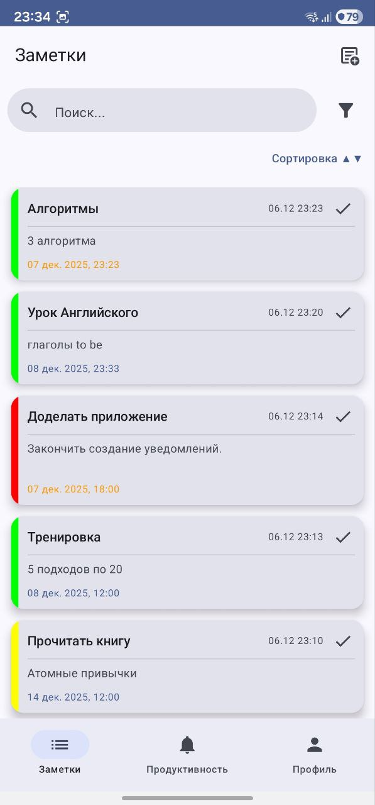
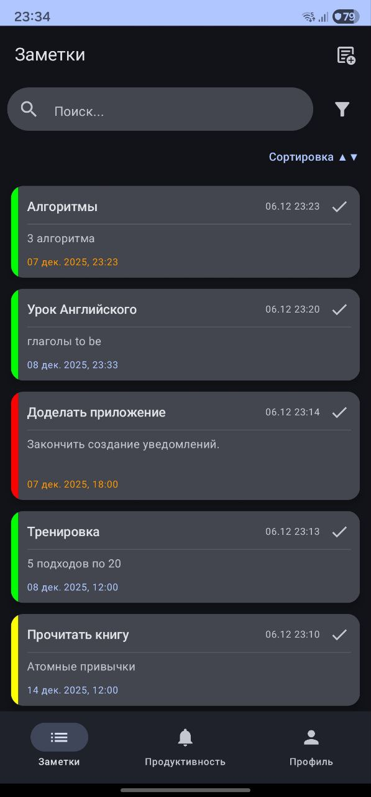
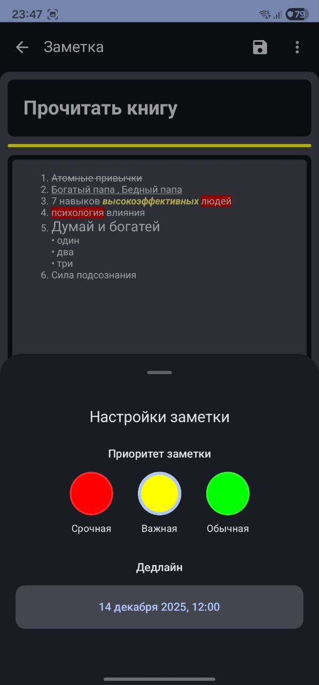
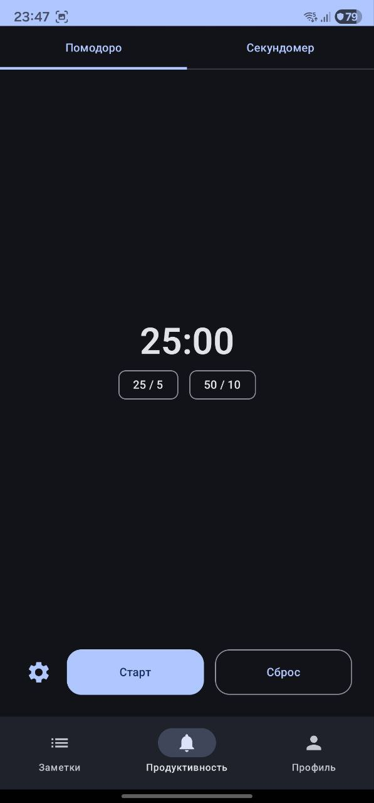
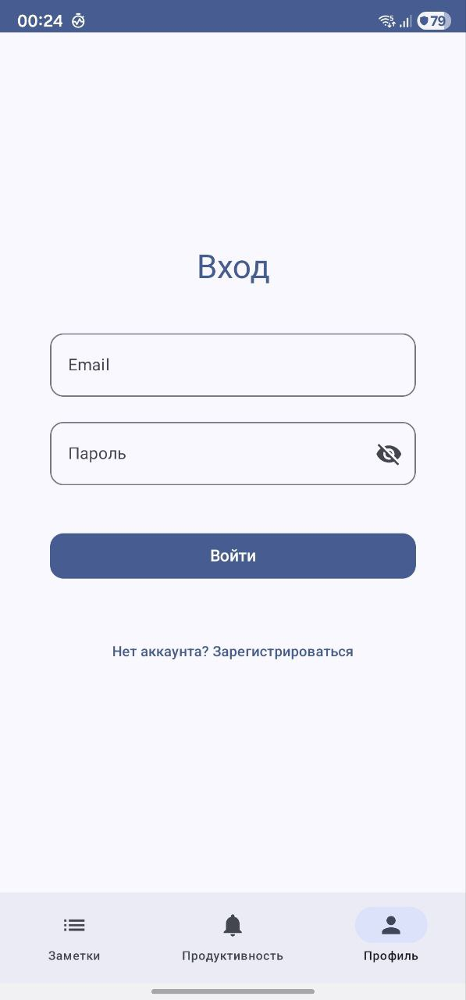

<details>
<summary><strong>Краткое описание проекта (нажмите, чтобы раскрыть)</strong></summary>

TodoList — современное Android-приложение для заметок и продуктивности, построенное на **Jetpack Compose**, **Clean Architecture**, **MVVM**, **Room**, **Firebase Auth / Firestore**, **WorkManager** и **Foreground Services**.

### Основные возможности:
- rich-text редактор (форматирование, цвета, шрифты, списки, выравнивание);
- приоритеты, дедлайны, уведомления за 1 час;
- автосохранение заметок (debounce 1.5 сек);
- Pomodoro и секундомер через foreground-service;
- онлайн/офлайн работа: Room + Firestore синхронизируются;
- регистрация и вход через Firebase Auth;
- полный UI с поддержкой светлой и тёмной темы.

### Архитектура:
- многомодульный проект: **app / data / domain**;
- **Clean Architecture + MVVM + UseCases**;
- DI через **Hilt**, навигация через **Navigation Compose**.

Проект ориентирован на демонстрацию профессиональных навыков Android-разработки: архитектура, работа с сервисами, фоновые задачи, синхронизация, управление состоянием, сложный UI и интеграции.

</details>

---

# TodoList — современное Android-приложение для заметок, построенное на Clean Architecture, Compose и Firebase

<p align="center">
  
  
  
  
  
  
  
</p>

Современное приложение-органайзер, демонстрирующее продвинутые навыки Android-разработки:
- Jetpack Compose + Clean Architecture + MVVM
- Rich-text редактор собственного уровня
- Pomodoro и секундомер через foreground-services
- Синхронизация: Room (offline) + Firebase Firestore (online)
- Firebase Auth + WorkManager + интерактивные уведомления
- Полная поддержка **светлой и тёмной темы** интерфейса

> Проект демонстрирует архитектурный подход, практическую работу с сервисами, стейт-менеджментом, асинхронностью, локальными и удалёнными источниками данных.

---

## Описание

TodoList — многофункциональное приложение для ведения заметок и повышения продуктивности.  
Использует Jetpack Compose, Clean Architecture, MVVM, Room, Firestore, Firebase Auth, WorkManager и Foreground Services.

---

## Основные возможности

### Rich-text редактор
- жирный / курсив / подчёркнутый / зачёркнутый текст
- цвет текста и фона
- размеры шрифта, типы шрифтов
- списки, выравнивание
- автосохранение (debounce 1.5 сек)

### Управление заметками
- приоритеты (срочная / важная / обычная)
- дедлайны
- уведомления за 1 час
- закрепление, удаление, массовые операции
- сортировка и фильтрация

### Pomodoro и секундомер
- стандартные и кастомные интервалы
- foreground service
- синхронизированные уведомления

### Авторизация и профиль
- Firebase Auth
- регистрация / вход
- сохранение данных пользователя
- синхронизация заметок по аккаунту

---

## Download APK

Чтобы протестировать приложение без сборки проекта и настройки Firebase, вы можете скачать готовый APK:

**[Скачать TodoList APK (Releases)](https://github.com/MalikISR/ToDoList/releases)**

APK можно установить:

- на физическое Android-устройство
- на эмулятор Android Studio

Это позволяет быстро оценить функциональность приложения: заметки, rich-text редактор, Pomodoro, уведомления, синхронизацию и работу тёмной/светлой темы.

---

## How to Run

### 1. Клонировать репозиторий

```bash
git clone https://github.com/MalikISR/ToDoList.git
```
### 2. Открыть проект в Android Studio (Hedgehog или новее)
### 3. Убедиться, что установлены:
Kotlin 1.9.24

Gradle 8+

Android SDK 34+

Android Studio Hedgehog+ / Koala

### 4. Настроить Firebase
<details>

<summary><strong> Подробнее об установке и настройке Firebase</strong></summary>
Полная официальная инструкция по подключению Firebase к Android-приложению находится здесь:

Ссылки:

- Как подключить Firebase к Android-приложению (гид с шагами):
  https://firebase.google.com/docs/android/setup

- Как скачать и установить `google-services.json` (Project Settings):
  https://console.firebase.google.com/project/_/settings/general

- Инструкция по Firebase Auth:
  https://firebase.google.com/docs/auth/android/start

- Инструкция по Firebase Firestore:
  https://firebase.google.com/docs/firestore/quickstart#kotlin+ktx

</details>

### 5. Выполнить Gradle Sync
Android Studio предложит выполнить Sync Now — подтвердить.

### 6. Собрать проект
Сборка выполняется автоматически при запуске приложения.

### 7. Запустить приложение
```Копировать код
Run → Run 'app'
```
После этого приложение полностью готово к работе.


---
# Скриншоты (ключевые)

Ниже представлены **основные 6 скриншотов**, отражающие ключевые возможности интерфейса.

| Список заметок (светлая) | Список заметок (тёмная) |
|--------------------------|--------------------------|
|  |  |

| Rich-text редактор | Настройки заметки |
|--------------------|-------------------|
|  |  |

| Pomodoro | Авторизация |
|----------|-------------|
|  |  |

---

# More screenshots

Приложение включает обширный набор экранов. Подробнее:

### Список заметок
- фильтрация  
  [filters_white.jpg](https://github.com/MalikISR/ToDoList/blob/master/screenshots/filters_white.jpg),  
  [filters_black.jpg](https://github.com/MalikISR/ToDoList/blob/master/screenshots/filters_black.jpg)
- сортировка  
  [sort.jpg](https://github.com/MalikISR/ToDoList/blob/master/screenshots/sort.jpg)
- синхронизация  
  [sinc.jpg](https://github.com/MalikISR/ToDoList/blob/master/screenshots/sinc.jpg)
- поиск  
  [search.jpg](https://github.com/MalikISR/ToDoList/blob/master/screenshots/search.jpg)
- массовое удаление  
  [delete_note.jpg](https://github.com/MalikISR/ToDoList/blob/master/screenshots/delete_note.jpg)
- закрепление / отметка выполнения  
  [pin_and_done_note.jpg](https://github.com/MalikISR/ToDoList/blob/master/screenshots/pin_and_done_note.jpg)
- дополнительные действия  
  [additional_actions.jpg](https://github.com/MalikISR/ToDoList/blob/master/screenshots/additional_actions.jpg)

### Экран заметки
- выбор шрифта  
  [font.jpg](https://github.com/MalikISR/ToDoList/blob/master/screenshots/font.jpg)
- выравнивание  
  [alignment.jpg](https://github.com/MalikISR/ToDoList/blob/master/screenshots/alignment.jpg)
- инструменты редактирования  
  [tools.jpg](https://github.com/MalikISR/ToDoList/blob/master/screenshots/tools.jpg)

### Продуктивность
- секундомер  
  [stopwatch_white.jpg](https://github.com/MalikISR/ToDoList/blob/master/screenshots/stopwatch_white.jpg)
- кастомный Pomodoro  
  [custom_pomodoro_white.jpg](https://github.com/MalikISR/ToDoList/blob/master/screenshots/custom_pomodoro_white.jpg),  
  [custom_pomodoro_black.jpg](https://github.com/MalikISR/ToDoList/blob/master/screenshots/custom_pomodoro_black.jpg)

### Уведомления
- уведомление Pomodoro / секундомера  
  [notification.jpg](https://github.com/MalikISR/ToDoList/blob/master/screenshots/notification.jpg)

### Авторизация и профиль
- регистрация  
  [registration_black.jpg](https://github.com/MalikISR/ToDoList/blob/master/screenshots/registration_black.jpg)
- профиль  
  [account.jpg](https://github.com/MalikISR/ToDoList/blob/master/screenshots/account.jpg)

---

Все файлы находятся в директории:  
[ /screenshots](https://github.com/MalikISR/ToDoList/tree/master/screenshots)


---

# Архитектура проекта

Проект построен на:

- **Clean Architecture** (модули `domain / data / app`)
- **MVVM**
- **Repository Pattern**
- **UseCase-ориентированная логика**
- **Hilt** для DI
- **Navigation Compose**

---

# Технологии

| Категория | Используемые решения |
|-----------|------------------------|
| UI | Jetpack Compose, Material 3 |
| DI | Hilt (Dagger) |
| База данных | Room |
| Синхронизация | Firebase Firestore |
| Авторизация | Firebase Auth |
| Асинхронность | Coroutines, Flow |
| Навигация | Navigation Compose |
| Background tasks | WorkManager, Foreground Services |
| Rich-text | RichEditor Compose |
| Доп. библиотеки | Accompanist SwipeRefresh |

---

## Автосохранение

Реализовано через debounce:
- отслеживание изменений в реальном времени
- сохранение через 1.5 сек паузы после начала бездействия
- обновление в Room + Firestore(Firestore только при синхронизации)

---

## Сервисы

### PomodoroService
- управление таймером
- синхронизация UI и уведомлений

### StopwatchService
- секундомер в фоне
- управление через уведомления

---

# Структура проекта

```md
app/
├── presentation/
├── notification/
├── di/
├── ui/
└── utils/

data/
├── local/ # Room database
├── remote/ # Firestore API
├── repository/
└── mapper/

domain/
├── model/
├── repository/
└── usecase/
```

---